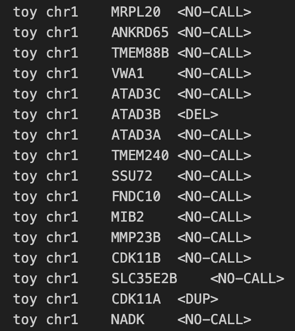

# CHALLENGER : Detecting Copy Number Variants in Challenging Regions Using Whole Genome Sequencing Data


[](https://doi.org/10.5281/zenodo.17593221)


> CHALLENGER is a RoBERTa-based deep learning tool designed for predicting copy number variations (CNVs) in challenging genomic regions using short-read whole-genome sequencing (WGS) data. See the <a href="https://www.biorxiv.org/content/10.1101/2025.11.23.690083v1">preprint</a> for more information.


> The repository with processed samples, ground truth data, and CNV predictions for all samples to reproduce the analyses in the paper can be found here : <a href="https://zenodo.org/records/17593221" target="_blank">**CHALLENGER results reproduction**</a>

> <a href="https://en.wikipedia.org/wiki/Deep_learning" target="_blank">**Deep Learning**</a>,  <a href="https://en.wikipedia.org/wiki/Copy-number_variation" target="_blank">**Copy Number Variation**</a>, <a href="https://en.wikipedia.org/wiki/Whole_genome_sequencing" target="_blank">**Whole Genome Sequencing**</a>


---

## Authors

Mehmet Alper Yilmaz, Ahmet Arda Ceylan, A. Ercument Cicek

---

## Questions & comments 

[firstauthorname].[firstauthorsurname]@bilkent.edu.tr

[lastauthorsurname]@cs.bilkent.edu.tr

---


## Table of Contents 

> Warning: Please note that CHALLENGER software is completely free for academic usage. However it is licenced for commercial usage. Please first refer to the [License](#license) section for more info.

- [Installation](#installation)
  - Requirements
- [Features](#features)
- [Instructions Manual for CHALLENGER](#instructions-manual-for-challenger)
  - Required Arguments
  - Optional Arguments
- [Usage Example](#usage-example)
  - Step-0: Install conda package management
  - Step-1: Set Up your environment
  - Step-2: Run the preprocessing script
  - Step-3: Run CHALLENGER
  - Output file of CHALLENGER
- [Instructions Manual for Fine-Tuning CHALLENGER](#instructions-manual-for-fine-tuning-challenger)
  - Required Arguments (Fine-Tuning)
  - Optional Arguments (Fine-Tuning)
- [Fine-Tune Example](#fine-tune-example)
  - Step-2: Preprocessing for Fine-Tuning
  - Step-3: Start Fine-Tuning
  - Model Weight Output Directory
- [License](#license)
---

## Installation

- CHALLENGER is a python3 script and it is easy to run after the required packages are installed.

- Please clone the repository using Git LFS:
  > git lfs clone https://github.com/ciceklab/CHALLENGER.git

- The latest fine-tuned CHALLENGER models can be downloaded from <a href="https://drive.google.com/file/d/1z7n0O9WO60iw2xCXfsG8NRGRht1vYe0z/view?usp=sharing">here</a>


### Requirements

For easy requirement handling, you can use CHALLENGER_environment.yml files to initialize conda environment with requirements installed:

```shell
$ conda env create --name challenger_env -f CHALLENGER_environment.yml
$ conda activate challenger_env
```

Note that the provided environment yml file is for Linux systems. For MacOS users, the corresponding versions of the packages might need to be changed.
---

## Features

- CHALLENGER provides GPU support optionally. See [GPU Support](#gpu-support) section.


## Instructions Manual for CHALLENGER
Important notice: Please call the CHALLENGER_call.py script from the scripts directory.

### Required Arguments

#### -bs, --batch-size
- Mini-batch size used during evaluation or inference.

#### -i, --input
- Path to the input Parquet file containing read-depth data.

#### -n, --normalize
- Path to the mean/std normalization file (.txt).

#### -b, --baseline-coverages-path
- Path to the baseline gene-coverage dictionary (.pt) used for gene-specific normalization of read-depth.

#### -t, --tokenizer-path
- Path to the tokenizer configuration file (.json).

#### -w, --weight
- Path to the fine-tuned model weight directory or checkpoint folder. You can download the fine-tuned CHALLENGER models from <a href="https://drive.google.com/file/d/1z7n0O9WO60iw2xCXfsG8NRGRht1vYe0z/view?usp=sharing">here</a>. It contains the following models:
    1) models/CHALLENGER-LR
    2) models/CHALLENGER-EXP
    3) models/CHALLENGER-GENE/<gene_name>

#### -o, --output-dir
- Directory where CNV calls, logs, and intermediate outputs will be saved.

#### -r, --run-name
- Name of the run


### Optional Arguments

#### -g, --gpu
- Set to PCI BUS ID of the gpu in your system.
- You can check, PCI BUS IDs of the gpus in your system with various ways. Using gpustat tool check IDs of the gpus in your system like below:


#### -h, --help
-  See help page.


## Usage Example

> CHALLENGER is very easy to use! Here, We provide an example small-sized BAM file and show how to run CHALLENGER on this toy dataset.

### Step-0: Install conda package management

- This project uses conda package management software to create virtual environment and facilitate reproducability.

- For Linux users:
 - Please take a look at the <a href="https://repo.anaconda.com/archive/" target="_blank">**Anaconda repo archive page**</a>, and select an appropriate version that you'd like to install.
 - Replace this `Anaconda3-version.num-Linux-x86_64.sh` with your choice

```shell
$ wget -c https://repo.continuum.io/archive/Anaconda3-vers.num-Linux-x86_64.sh
$ bash Anaconda3-version.num-Linux-x86_64.sh
```


### Step-1: Set Up your environment.

- It is important to set up the conda environment which includes the necessary dependencies.
- Please run the following lines to create and activate the environment:

```shell
$ conda env create --name challenger_env -f CHALLENGER_environment.yml
$ conda activate challenger_env
```

### Step-2: Run the preprocessing script.

- Preprocessing is required to convert raw WGS data into standardized read-depth and metadata representations suitable for CNV calling. The pipeline generates per-sample read-depth files (_W50.txt) and then processes and combines these files into a single consolidated Parquet file, which serves as the model’s input.
- Please run the following line:

```shell
$ source preprocess_samples.sh
```

### Step-3: Run CHALLENGER on data obtained in Step-2

- Here, we demonstrate an example to run CHALLENGER on gpu device 0, and obtain CNV call.
- Please run the following script:

```shell
$ source challenger_call.sh
```

### Output file of CHALLENGER
- At the end of the CNV calling procedure, CHALLENGER will write its output file to the directory given with -o option. In this tutorial it is ./outputs
- Output file of CHALLENGER is a tab-delimited. 
- Columns in the gene-level output file of CHALLENGER are the following with order: 1. Sample Name, 2. Chromosome, 3. Gene Name, 4. CHALLENGER Prediction 
- Following figure is an example of CHALLENGER gene-level output file.



---
## Instructions Manual for Fine-Tuning CHALLENGER
Important notice: Please call the CHALLENGER_FT.py script from the scripts directory.

### Required Arguments

#### -bs, --batch-size
- Mini-batch size used during Fine-Tuning.

#### -i, --input
- Path to the input Parquet file containing read-depth data.

#### -n, --normalize
- Path to the mean/std normalization file (.txt).

#### -b, --baseline-coverages-path
- Path to the baseline gene-coverage dictionary (.pt) used for gene-specific normalization of read-depth.

#### -t, --tokenizer-path
- Path to the tokenizer configuration file (.json).

#### -w, --init-weight
- Path to the initial model weight directory or checkpoint folder. You can download the fine-tuned CHALLENGER models from <a href="https://drive.google.com/file/d/1z7n0O9WO60iw2xCXfsG8NRGRht1vYe0z/view?usp=sharing">here</a>. It contains the following models:
    1) models/CHALLENGER-LR
    2) models/CHALLENGER-EXP
    3) models/CHALLENGER-GENE/<gene_name>

#### -ep, --num-epoch
- Number of training epochs.

#### -o, --output-dir
- Path where the trained model weights will be saved.

#### -r, --run-name
- Name of the run


### Optional Arguments

#### -g, --gpu
- Set to PCI BUS ID of the gpu in your system.
- You can check, PCI BUS IDs of the gpus in your system with various ways. Using gpustat tool check IDs of the gpus in your system like below:


#### -h, --help
-  See help page.


## Fine-Tune Example
> You may want to fine-tune CHALLENGER with your WGS dataset. We provide an example of how CHALLENGER can be fine-tuned using the same small-sized CRAM file along with its corresponding ground truth calls.

> Step-0 and Step-1 are the same as the CHALLENGER call example.


### Step-2: Run the preprocessing script.

- Preprocessing is required to convert raw WGS data into standardized read-depth and metadata formats suitable for CNV calling. The pipeline produces per-sample read-depth files (_W50.txt) and then processes and merges them into a single consolidated Parquet file, which is required for fine-tuning.
- Please run the following line:

```shell
$ source preprocess_samples_FT.sh
```

### Step-3: Run CHALLENGER Fine-Tuning script using the data obtained in Step-2

- Here, we demonstrate an example to fine-tune CHALLENGER on gpu device 0.
- Please run the following script:

```shell
$ source challenger_FT.sh
```

### Model Weight Output Directory
- During fine-tuning, CHALLENGER saves the model weights to the directory specified with -o, which in this tutorial is /FT_weights.


---

## License


- **[CC BY-NC-SA 2.0](https://creativecommons.org/licenses/by-nc-sa/2.0/)**
- Copyright 2025 © CHALLENGER.
- For commercial usage, please contact.
